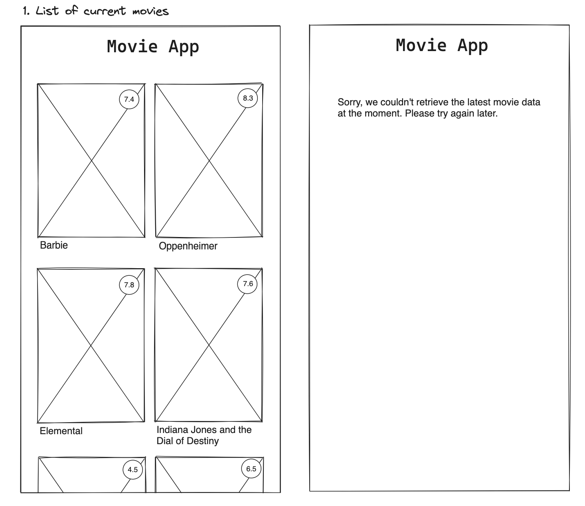

# Title

List of Movies

## Value Proposition

As someone who has no idea about movies but is planning to go to the cinema or watch a movie at home  

I want to see a list of all current movies  

so that I can get an overview of which films I'm interested in.  

## Description

## Acceptance Criteria

- A list of all current movies is displayed
- Each movie is displayed with film
  - poster
  - title
  - rating
- The list is scrollable which is visible immediately because the bottom posters are not fully visible (half out of view to bottom of the page)
- If movies are not loading, an error message is displayed

## Tasks

- Create a (Git) feature branch `MovieList`

- Create a `MovieList` component which maps over all movies and passes props to the `Movie` component and returns the movies

- Create a `Movie` component containing the props `title`, `ranking` and `image`/`poster`

- In `index.js`:
  - fetch current movies from API with integrated error handling
  - pass on props to `Movie` component via `MovieList`
  - render movie list in the main section of the welcome page by importing and calling the `MovieList` component in `index.js`
